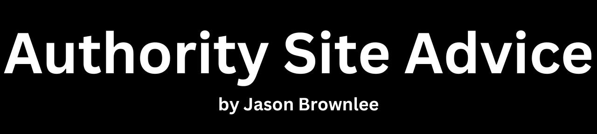

# Authority Site Advice

Advice on how to build, operate, and sell an authority website (niche site) by yourself (solopreneur).

## About

An authority website is a highly trusted and reputable online platform recognized for its extensive, well-researched content and expertise in a specific niche or industry.

I've had [some success](notes/success.md) with authority websites over the years. I'm often asked about how to get started.

This project captures my best advice: to consume quality blogs/podcasts/books on the topic and do what they say. This is how I got started.

I used to send emails with lists of podcasts and books, then later directed people to my goodreads [authority shelf](https://www.goodreads.com/review/list/5243638-jason?shelf=authority-site) and [writing shelf](https://www.goodreads.com/review/list/5243638-jason?shelf=writing).

## Thesis

[My thesis](notes/thesis.md) is that developers are under huge time pressures to get results. They would prefer to search for solutions online and copy-paste code rather than read and understand API docs. I refer to this as: "_no one will RTFM_". Most APIs are open source and most API docs are terse and user-hostile and developers prefer worked examples over function definitions.

A specific undeserved technical topic is selected as the focus for the authority site, that then offers a vast number of tutorials and answer all the common questions about the topic. Developers that need help with the topic find it via Google searches and keep coming back as the content is free and helpful, which builds trust. In exchange for an email address I offer more value in the form of free cheat sheets, guides, and email courses to readers. I then offer paid self-study information products for those readers looking to learn the topic systematically and to a greater depth.

It requires a love of daily writing, daily helping/serving developers, and figuring out messy technical topics. This model is repeatable, a skill that can be taught/learned, and can be iteratively improved upon. Therefore continuous study of the model itself (this project) is an important part of the model.

Below are the best resources to support this thesis.

## Blogs/Podcasts, Courses, Essays

### Blogs/Podcasts

* [AuthorityHacker](https://www.authorityhacker.com/), Mark and Gael.
* [Tropical MBA](https://tropicalmba.com/), Dan and Ian.
* [Niche Pursuits](https://www.nichepursuits.com/), Spencer Haws.
* [My First Million](https://www.mfmpod.com/), Sam and Shaan.
* [Founders](https://founders.simplecast.com/), David Senra.

Historical content that had a big impact on me circa 2013.

* [Lifestyle Business Podcast](https://web.archive.org/web/20130117204305/http://www.lifestylebusinesspodcast.com/) (archived), Dan and Ian.
	* Became [TropicalMBA](https://tropicalmba.com/)
* [Adsense Flippers](https://web.archive.org/web/20120101013606/http://adsenseflippers.com/) (archived), Justin Cooke and Joe Magnotti.
	* Became [Empire Flippers](https://empireflippers.com/)
* [Internet Business Mastery](https://web.archive.org/web/20130330065233/http://internetbusinessmastery.com/) (archived), Jeremy and Jason.
* [Foolish Adventure](https://web.archive.org/web/20130102081309/http://foolishadventure.com/) (archived), Tim Conley.
	* Became [Tim Conley](https://timconley.webflow.io/)
* [Super Fast Business](https://web.archive.org/web/20140113035135/http://www.superfastbusiness.com/) (archived), James Schramko.
	* Became: [JamesSchramko.com](https://www.jamesschramko.com/)
* [Sales Marketing Profit](https://web.archive.org/web/20140627110225/http://www.salesmarketingprofit.com/) (archived), James Schramko and Taki Moore.
	* Became [Sales Marketing Profit Podcast](https://www.jamesschramko.com/category/sales-marketing-profit)
* [Entrepreneurs Journey](https://web.archive.org/web/20130115055320/http://entrepreneurs-journey.com/), (archived), Yaro Starak.
	* Became [Yaro.com](https://yaro.blog/)
* [The Rise To The Top](https://web.archive.org/web/20130126031204/http://www.therisetothetop.com/) (archived), David Siteman Garland.
* [Stacking the Bricks](https://stackingthebricks.com/podcast/), Amy Hoy and Alex Hillman.
* [Smart Passive Income](https://www.smartpassiveincome.com/), Pat Flynn.
* [ProBlogger](https://problogger.com/), Darren Rowse.

### Courses

I think most of these courses are retired, but they all had a massive impact.

* [Internet Business Mastery Academy](https://web.archive.org/web/20140227033939/http://internetbusinessmastery.com/academy/a3/login/) (archived), Jeremy and Jason.
* [Micropreneur Academy](https://web.archive.org/web/20130115104116/http://www.micropreneur.com/) (archived), Rob Walling and Mike Taber.
	* Became [FounderCafe](https://www.foundercafe.com/)
* [Empire Starter Pack: Premium](https://web.archive.org/web/20130810134618/http://empireflippers.com/empire-starter-packs/) (archived), Justin Cooke and Joe Magnotti.
* Copy Hackers 7 eBook Bundle, Joanna Wiebe.
	* Became [CopyHackers Library](https://copyhackers.com/books/)
* [Altitude](https://ebenpagantraining.com/product/altitude/), Eben Pagan.

If I was starting today, I would consider the following courses:

* [30x500 Academy](https://30x500.com/academy/), Amy Hoy and Alex Hillman
* [The Authority Site System or AuthorityHacker Pro](https://www.authorityhacker.com/courses/), Mark and Gael.
* [Monthly1K](https://appsumo.com/products/monthly1k/), Noah Kagan.

### Essays

* [1000 True Fans](https://kk.org/thetechnium/1000-true-fans/), Kevin Kelly.
	* [Notes](notes/1000_true_fans.md)
* [Paul Graham Essays](http://www.paulgraham.com/articles.html), Paul Graham.
* [Derek Sivers Essays](https://sive.rs/blog), Derek Sivers.
* [How to Get Rich](https://nav.al/rich), Naval Ravikant.
	* [Notes](notes/how_to_get_rich.md)
* [The Stair Step Method of Bootstrapping](https://robwalling.com/2015/03/26/the-stair-step-method-of-bootstrapping/), Rob Walling.
	* [Notes](notes/the_stair_step_method_of_bootstrapping.md)
* [The ladders of wealth creation: a step-by-step roadmap to building wealth](https://nathanbarry.com/wealth-creation/), Nathan Barry.
* [The 1000 Day Rule: What Living the Dream Really Looks Like](https://tropicalmba.com/articles/living-the-dream), Dan Andrews.
	* [Notes](notes/the_1000_day_rule.md)
* [How to Succeed in Business by Bundling - and Unbundling](https://hbr.org/2014/06/how-to-succeed-in-business-by-bundling-and-unbundling), Jim Barksdale.
	* [Notes](notes/how_to_succeed_in_business_by_bundling_and_unbundling.md)

## Books on Authority Sites

### Website / Digital Business

* [DotCom Secrets: The Underground Playbook for Growing Your Company Online](https://amzn.to/3DAafnW), Russell Brunson.
	* [Notes](notes/dotcom_secrets.md)
* [The Millionaire Fastlane: Crack the Code to Wealth and Live Rich for a Lifetime!](https://amzn.to/3OCJHss), M.J. DeMarco.
	* [Notes](notes/the_millionaire_fastlane.md)
* [Crush It!: Why Now Is the Time to Cash In on Your Passion](https://amzn.to/44OBpU6), Gary Vaynerchuk.
	* [Notes](notes/crush_it.md)
* [Work Less, Make More: The counter-intuitive approach to building a profitable business, and a life you actually love](https://amzn.to/3OMDBWN), James Schramko.
	* [Notes](notes/work_less_make_more.md)
* [The Minimalist Entrepreneur: How Great Founders Do More with Less](https://amzn.to/43KOEUl), Sahil Lavingia.
	* [Notes](notes/the_minimalist_entrepreneur.md)
* [How to Get Paid for What You Know: Turning Your Knowledge, Passion, and Experience into an Online Income Stream in Your Spare Time](https://amzn.to/44ZVHd0), Graham Cochrane.
	* [Notes](notes/how_to_get_paid_for_what_you_know.md)
* [Building A Niche Site Empire](https://amzn.to/45d1vA5), John DeVries.

### Work Solo

* [The Million-Dollar, One-Person Business: Make Great Money. Work the Way You Like. Have the Life You Want](https://amzn.to/3DDpRqO), Elaine Pofeldt.
	* [Notes](notes/the_million_dollar_one_person_business.md)
* [Small Giants: Companies That Choose to Be Great Instead of Big](https://amzn.to/3Olvj6H), Bo Burlingham.
	* [Notes](notes/small_giants.md)
* [Company Of One: Why Staying Small Is the Next Big Thing for Business](https://amzn.to/3QkTTas), Paul Jarvis.
	* [Notes](notes/company_of_one.md)
* [Start Small, Stay Small: A Developer's Guide to Launching a Startup](https://amzn.to/3YhpcVx), Rob Walling.
	* [Notes](notes/start_small_stay_small.md)
* [Tiny Business, Big Money: Strategies for Creating a High-Revenue Microbusiness](https://amzn.to/3DBBTks), Elaine Pofeldt.

### Business

* [The Almanack of Naval Ravikant: A Guide to Wealth and Happiness](https://amzn.to/3QhEhUX), Eric Jorgenson.
	* [Notes](notes/the_almanack_of_naval_ravikant.md)
* [The 4-Hour Workweek: Escape 9-5, Live Anywhere, and Join the New Rich](https://amzn.to/47ifFl1), Timothy Ferriss.
	* [Notes](notes/the_4_hour_workweek.md)
* [Ready, Fire, Aim: Zero to $100 Million in No Time Flat](https://amzn.to/3Ql9VAT), Michael Masterson.
	* [Notes](notes/ready_fire_aim.md)
* [Zero to One: Notes on Start Ups, or How to Build the Future](https://amzn.to/3qaXey2), Peter Thiel.
	* [Notes](notes/zero_to_one.md)
* [Business Made Simple: 60 Days to Master Leadership, Sales, Marketing, Execution, Management, Personal Productivity and More](https://amzn.to/3Ko8fTI), Donald Miller.
	* [Notes](notes/business_made_simple.md)
* [The E-Myth Revisited: Why Most Small Businesses Don't Work and What to Do About](https://amzn.to/3DDCv9b), Michael Gerber.
	* [Notes](notes/the_e_myth_revisited.md)

## Books on Niche Selection

* [Will It Fly?: How to Test Your Next Business Idea So You Don't Waste Your Time and Money](https://amzn.to/44N6FD3), Pat Flynn.
	* [Notes](notes/will_it_fly.md)
* [Choose: The Single Most Important Decision Before Starting Your Business](https://amzn.to/3rVP0KU), Ryan Levesque.
	* [Notes](notes/choose.md)
* [The Mom Test: How to talk to customers & learn if your business is a good idea when everyone is lying to you](https://amzn.to/3DCKVxy), Rob Fitzpatrick.
	* [Notes](notes/the_mom_test.md)
* [Become Known For A Niche You Own: Why Legendary Writers Use Languaging To Design New & Different Categories](https://amzn.to/3QnXggG), Category Pirates.

## Books on Operations

### Work Smart/Hard

* [Be Obsessed or Be Average](https://amzn.to/44N6kjL), Grant Cardone.
	* [Notes](notes/be_obsessed_or_be_average.md)
* [If You're Not First, You're Last: Sales Strategies to Dominate Your Market and Beat Your Competition](https://amzn.to/3DD8aaU), Grant Cardone.
	* [Notes](notes/if_youre_not_first_youre_last.md)
* [Getting Everything You Can Out of All You've Got: 21 Ways You Can Out-Think, Out-Perform, and Out-Earn the Competition](https://amzn.to/3rSJMzq), Jay Abraham.
	* [Notes](notes/getting_everything_you_can_out_of_all_youve_got.md)
* [The Effective Executive: The Definitive Guide to Getting the Right Things Done](https://amzn.to/44Jm0nY), Peter Drucker.
	* [Notes](notes/the_effective_executive.md)

### Mindset

* [Start with Why: How Great Leaders Inspire Everyone to Take Action](https://amzn.to/3rJw5mc), Simon Sinek.
	* [Notes](notes/start_with_why.md)
* [The Infinite Game](https://amzn.to/3Kpw25r), Simon Sinek.
	* [Notes](notes/the_infinite_game.md)
* [The Practice: Shipping Creative Work](https://amzn.to/43Q9TnG), Seth Godin.
	* [Notes](notes/the_practice.md)
* [Steal Like an Artist: 10 Things Nobody Told You About Being Creative](https://amzn.to/3ODXjDG), Austin Kleon.
	* [Notes](notes/steal_like_an_artist.md)
* [Show Your Work!: 10 Ways to Share Your Creativity and Get Discovered](https://amzn.to/3ODXxe0), Austin Kleon.
	* [Notes](notes/show_your_work.md)
* [Keep Going: 10 Ways to Stay Creative in Good Times and Bad](https://amzn.to/456O2d0), Austin Kleon.
	* [Notes](notes/keep_going.md)
* [The Icarus Deception: How High Will You Fly?](https://amzn.to/44QrgGu), Seth Godin.
	* [Notes](notes/the_icarus_deception.md)

### Engage to Learn

* [Superfans: The Easy Way to Stand Out, Grow Your Tribe, And Build a Successful Business](https://amzn.to/455vQAn), Pat Flynn.
	* [Notes](notes/superfans.md)
* [Ask: The Counterintuitive Online Formula to Discover Exactly What Your Customers Want to Buy...Create a Mass of Raving Fans...and Take Any Business to the Next Level](https://amzn.to/3YhWBiS), Ryan Levesque.
	* [Notes](notes/ask.md)
* [Tribes: We need you to lead us](https://amzn.to/3rZNlUj), Seth Godin.
	* [Notes](notes/tribes.md)

### Daily Results Compound

* [The Compound Effect: Jumpstart Your Income, Your Life, Your Success](https://amzn.to/47aN15r), Darren Hardy.
	* [Notes](notes/the_compound_effect.md)
* [The Slight Edge: Turning Simple Disciplines into Massive Success and Happiness](https://amzn.to/3Kly3jl), Jeff Olson.
	* [Notes](notes/the_slight_edge.md)

## Books on Writing Content

### Writing

* [Do the Work: Overcome Resistance and Get Out of Your Own Way](https://amzn.to/3rVP90U), Steven Pressfield.
* [The War of Art: Winning the Inner Creative Battle](https://amzn.to/3YhWOTc), Steven Pressfield.
* [Turning Pro: Tap Your Inner Power and Create Your Life's Work](https://amzn.to/3Qkc0wY), Steven Pressfield.
* [Nobody Wants to Read Your Shit: Why That Is And What You Can Do About It](https://amzn.to/3Oisx1N), Steven Pressfield.

### Content Marketing

* [The Art and Business of Online Writing: How to Beat the Game of Capturing and Keeping Attention](https://amzn.to/3DCKALi), Nicolas Cole.
* [Content Inc.: How Entrepreneurs Use Content to Build Massive Audiences and Create Radically Successful Businesses](https://amzn.to/3qgg3zV), Joe Pulizzi.
* [Compound Marketing: How Smart Entrepreneurs Use Asset-Building Marketing Strategies for an Unfair Growth Advantage](https://amzn.to/3Ko8huO), Dan Norris.
* [Content Machine: Use Content Marketing to Build a 7-figure Business With Zero Advertising](https://amzn.to/3OzVUhF), Dan Norris.
* [They Ask, You Answer: A Revolutionary Approach to Inbound Sales, Content Marketing, and Today's Digital Consumer](https://amzn.to/44OCsDw), Marcus Sheridan.

### Technical Writing

* [Developer Marketing Does Not Exist: The Authentic Guide to Reach a Technical Audience](https://amzn.to/3OCKFVC), Adam DuVander.
* [How to Make Sense of Any Mess: Information Architecture for Everybody](https://amzn.to/44FVnAl), Abby Covert.
* [Docs for Developers: An Engineer's Field Guide to Technical Writing](https://amzn.to/3YdtlKb), Jared Bhatti.
* [Writing for Software Developers](https://philipkiely.com/wfsd/), Philip Kiely.
* [Every Page Is Page One](https://amzn.to/3OD6eFA), Mark Baker.

### Information Products

* [Authority: A Step-by-Step Guide to Self-Publishing](https://amzn.to/458KQgN), Nathan Barry.
	* [Notes](notes/authority.md)
* [Write Useful Books: A modern approach to designing and refining recommendable nonfiction](https://amzn.to/3KJQWN9), Rob Fitzpatrick.
* [Write a Must-Read: Craft a Book That Changes Lives―Including Your Own](https://amzn.to/3qbG5o0), A.J. Harper.
	* [Notes](notes/write_a_must_read.md)
* [Badass: Making Users Awesome](https://amzn.to/455wgqr), Kathy Sierra.
* [Designing Products People Love: How Great Designers Create Successful Products](https://amzn.to/3OBC0CL), Scott Hurff.
* [$100M Offers: How To Make Offers So Good People Feel Stupid Saying No](https://amzn.to/3ODgkq7), Alex Hormozi.
	* [Notes](notes/100m_offers.md)
* [Jobs to be Done: Theory to Practice](https://amzn.to/43OVGYg), Anthony Ulwick.
* [Continuous Discovery Habits: Discover Products that Create Customer Value and Business Value](https://amzn.to/43K6HKw), Teresa Torres.
* [Obviously Awesome: How to Nail Product Positioning so Customers Get It, Buy It, Love It](https://amzn.to/3QkUDfK), April Dunford.
* [Launch: An Internet Millionaire's Secret Formula to Sell Almost Anything Online, Build a Business You Love, and Live the Life of Your Dreams](https://amzn.to/3DBXPff), Jeff Walker.

## Books on Sales and Marketing

* [80/20 Sales and Marketing: The Definitive Guide to Working Less and Making More](https://amzn.to/43OTP5R), Perry Marshall.
	* [Notes](notes/80_20_sales_and_marketing.md)
* [Digital Marketing For Dummies](https://amzn.to/3rUufz5), Ryan Deiss.
	* [Notes](notes/digital_marketing_for_dummies.md)
* [Building a StoryBrand: Clarify Your Message So Customers Will Listen](https://amzn.to/459q6pf), Donald Miller.
	* [Notes](notes/building_a_storybrand.md)
* [Marketing Made Simple: A Step-by-Step StoryBrand Guide for Any Business](https://amzn.to/3Yk0GTB), Donald Miller.
	* [Notes](notes/marketing_made_simple.md)
* [To Sell is Human: The Surprising Truth About Moving Others](https://amzn.to/3Yk0P9B), Daniel Pink.
	* [Notes](notes/to_sell_is_human.md)
* [Traction: A Startup Guide to Getting Customers](https://amzn.to/3YvJ47D), Gabriel Weinberg.
	* [Notes](notes/traction.md)
* [This is Marketing: You Can't Be Seen Until You Learn To See](https://amzn.to/3YiEyJa), Seth Godin.
	* [Notes](notes/this_is_marketing.md)
* [Magnetic Marketing: How To Attract A Flood Of New Customers That Pay, Stay, and Refer](https://amzn.to/3Of7flJ), Dan Kennedy.
	* [Notes](notes/magnetic_marketing.md)
* [Influence: The Psychology of Persuasion](https://amzn.to/3QkTZPp), Robert Cialdini.
	* [Notes](notes/influence.md)

### Email Marketing

* [Permission Marketing](https://amzn.to/47hjCGA), Seth Godin.
	* [Notes](notes/permission_marketing.md)
* [Invisible Selling Machine](https://amzn.to/44UPlMw), Ryan Deiss.
	* [Notes](notes/invisible_selling_machine.md)

### Positioning

* [Snow Leopard: How Legendary Writers Create A Category Of One](https://amzn.to/3rP41Oq), Category Pirates.
* [Expert Secrets: The Underground Playbook for Finding Your Message, Building a Tribe, and Changing the World](https://amzn.to/3YiEpW8), Russell Brunson.
* [Positioning: The Battle for Your Mind](https://amzn.to/3QlSsZg), Al Ries and Jack Trout.
* [Blue Ocean Strategy: How to Create Uncontested Market Space and Make the Competition Irrelevant](https://amzn.to/3qkLUzk), W. Chan Kim, Renee Mauborgne.
* [Differentiate or Die: Survival in Our Era of Killer Competition](https://amzn.to/3Okn0rE), Jack Trout.

### Copywriting

* [The Ultimate Sales Letter: Attract New Customers. Boost Your Sales](https://amzn.to/3QjiBI2), Dan Kennedy.
	* [Notes](notes/the_ultimate_sales_letter.md)
* [The Adweek Copywriting Handbook: The Ultimate Guide to Writing Powerful Advertising and Marketing Copy from One of America's Top Copywriters](https://amzn.to/3rX13qZ), Joseph Sugarman.
	* [Notes](notes/the_adweek_copywriting_handbook.md)
* [Copywriting Secrets: How Everyone Can Use The Power Of Words To Get More Clicks, Sales and Profits . . . No Matter What You Sell Or Who You Sell It To!](https://amzn.to/44PdyDF), Jim Edwards.
	* [Notes](notes/copywriting_secrets.md)
* [How to Write the Perfect Sales Page (Even If You're Not a Copywriter): The 12-Step Sales Page Template](https://amzn.to/44MhyVr), Nathan Fraser.
	* [Notes](notes/how_to_write_the_perfect_sales_page.md)

## Books Selling the Business

* [Built to Sell: Creating a Business That Can Thrive Without You](https://amzn.to/3rKoRhM), John Warrillow.
* [The Art of Selling Your Business: Winning Strategies & Secret Hacks for Exiting on Top](https://amzn.to/3YmJ1ec), John Warrillow.
* [Finish Big: How Great Entrepreneurs Exit Their Companies on Top](https://amzn.to/3KhOTPN), Bo Burlingham.
* [Before The Exit: Thought Experiments For Entrepreneurs](https://amzn.to/3KhQ5Th), Dan Andrews.

## After Exiting

After exiting, you have to deal with two things:

1. Now what? What is the meaning of life?
2. What do you with the money? How do you invest and live off investment income?

See my goodreads [retirement shelf](https://www.goodreads.com/review/list/5243638-jason?shelf=retirement) and [personal finance shelf](https://www.goodreads.com/review/list/5243638-jason?shelf=personal-finance) for how I explored these issues.

## Final Remarks

### On Advice

I've had tens of coffees where people "pick my brain" about building an authority site business.

I've sent hundreds of emails with book recommendations to people asking how to get started.

As far as I know, zero people I have advised started anything.

I don't think people take advice. Honestly, I think the above resources are only useful to those who have already started building an authority site business or are already running one. I don't know how to motivate someone who is interested, to actually start.

But I might be wrong. If only one person is inspired to dive in, then this guide was worth it.

Probably the real goal of this project is so that I can talk to myself. There is so much stuff to keep in your head to do "authority sites" well that I need to constantly remind myself of things. Re-reading books and adding notes to this project does that for me.

### Disclosures

I have added links to all books on Amazon. If you purchase a book from Amazon using my links, thank you kindly. As an Amazon Associate I earn from qualifying purchases.

I have added notes on some books and essays. ChatGPT was used to provide lists of the main points.

### Email me

Did this guide help? Please let me know.

I love books. Do you have any recommendations? Please share some titles.

If you want to chat about authority sites, please email me.

Jason Brownlee
jason.brownlee05@gmail.com
